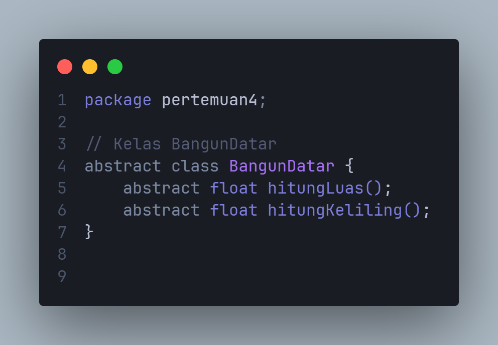
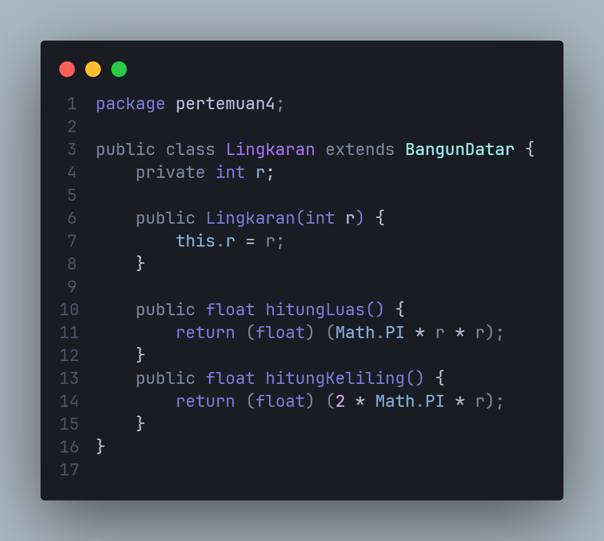
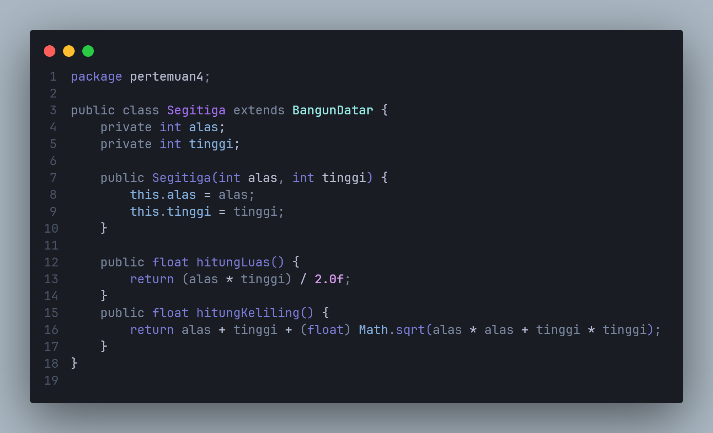
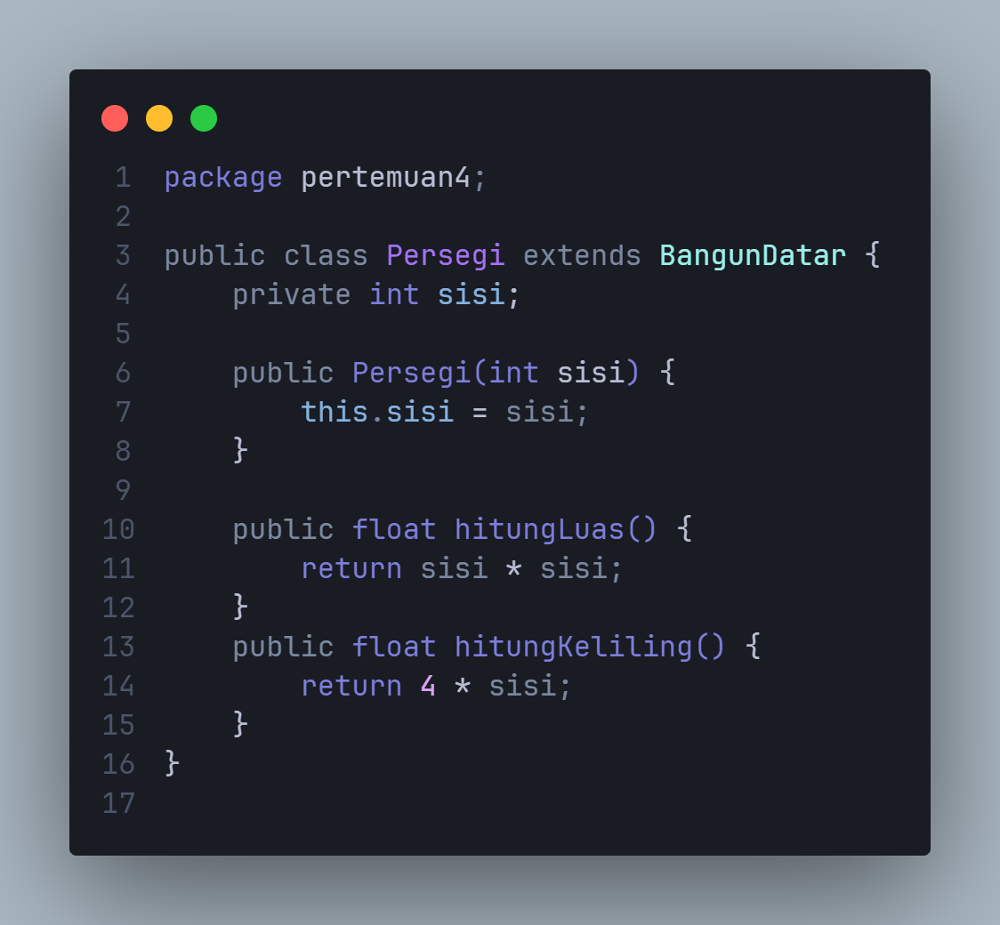
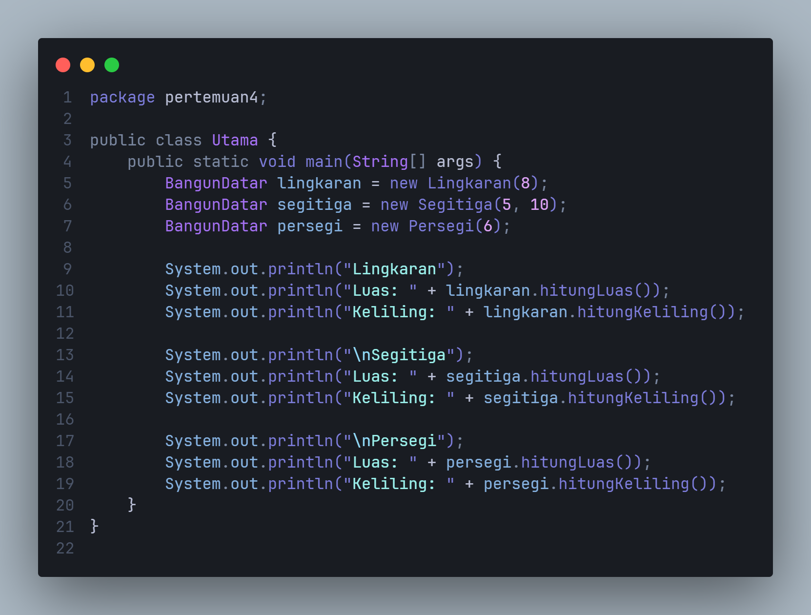
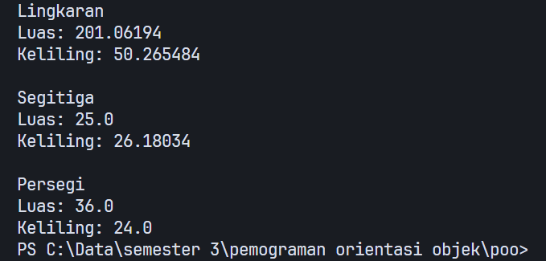

# Pertemuan4
### Zaky Putra Pratama
### 312310613
# 
## MEMBUAT BANGUN DATAR
Projek `BangunDatar` dengan java ini mengunakan konsep `inheritance` dan `polymorphism` terdiri dari class turunan bangun datar
->`Lingkaran`, `Segitiga`, `Persegi` mengimplementasikan metode luas dan keliling sesuai dengan rumus masing-masing bentuk,
program main dengan nama class `Utama` untuk memunculkan hasilnya, berikut semua codenya :
# 
## BangunDatar
Kelas abstrak mendefinisikan metode abstrak `luas()` dan `keliling()`

---
## Lingkaran

---
## Segitiga

---
## Persegi

---
## Utama
**(Main)**

### Output

---
